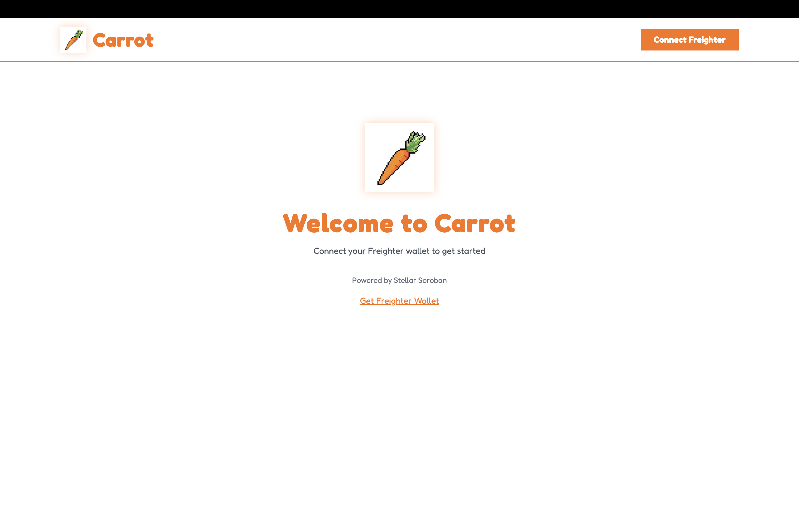
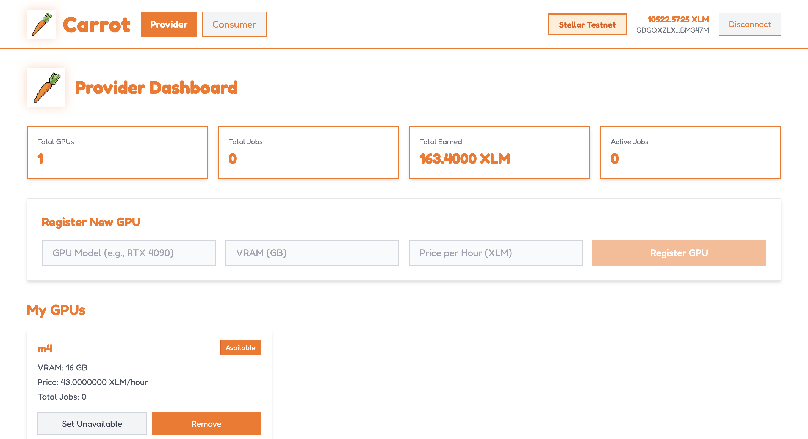
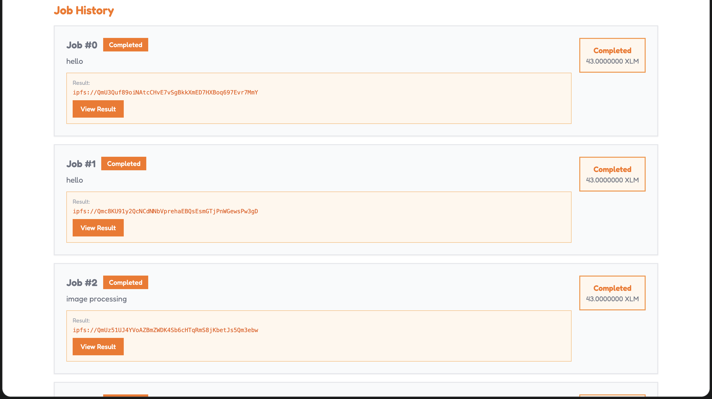

# Carrot - First Ever DePIN on Stellar

The first Decentralized Physical Infrastructure Network (DePIN) built on Stellar Soroban, enabling peer-to-peer GPU sharing for AI/ML compute workloads.

## Project Title

**Carrot** - Decentralized GPU Sharing Platform on Stellar Soroban

## Project Description

Carrot is a pioneering DePIN (Decentralized Physical Infrastructure Network) marketplace that brings GPU compute sharing to the Stellar blockchain. It connects GPU hardware owners with users who need compute power, creating a trustless, decentralized marketplace for AI and machine learning workloads.

Built on Stellar Soroban smart contracts, Carrot enables:
- GPU providers to monetize idle hardware by processing compute jobs
- Consumers to access affordable, on-demand GPU power without centralized cloud providers
- Trustless payments with XLM escrow ensuring fair compensation

This is the first implementation of a DePIN protocol on the Stellar network, demonstrating the capability of Soroban smart contracts for real-world physical infrastructure applications.

## Contract Addresses

Both smart contracts are deployed and verified on Stellar Testnet:

| Contract | Address | Explorer |
|----------|---------|----------|
| GPU Registry | `CDPGJH4OHPUSGUHUZA2CFJXWTGPGPMEIPJVKVKH5UYDUY4KTHLTYYIWZ` | [View on Stellar Expert](https://stellar.expert/explorer/testnet/contract/CDPGJH4OHPUSGUHUZA2CFJXWTGPGPMEIPJVKVKH5UYDUY4KTHLTYYIWZ) |
| Job Marketplace | `CBAIX6OR64QCYOVWCIOWKLE2QUAVWW5HHUQOE5LX2VXLGKIVKML5EZ76` | [View on Stellar Expert](https://stellar.expert/explorer/testnet/contract/CBAIX6OR64QCYOVWCIOWKLE2QUAVWW5HHUQOE5LX2VXLGKIVKML5EZ76) |

## Problem Statement

### The Problem

1. **Underutilized GPU Hardware**: Millions of GPUs sit idle in personal computers and small data centers, representing wasted computational potential worth billions of dollars annually.

2. **Expensive Cloud GPU Access**: Major cloud providers (AWS, GCP, Azure) charge premium prices for GPU instances, making AI/ML development prohibitively expensive for individuals, startups, and researchers.

3. **Centralization Risks**: Current GPU cloud infrastructure is controlled by a handful of corporations, creating single points of failure, censorship risks, and geographic limitations.

4. **No Stellar DePIN Ecosystem**: While other blockchains have DePIN protocols, Stellar lacked any decentralized physical infrastructure solutions despite its fast, low-cost transaction capabilities.

### Our Solution

Carrot solves these problems by:

1. **Creating a P2P GPU Marketplace**: Connecting GPU owners directly with consumers, eliminating middlemen and reducing costs by up to 80% compared to traditional cloud providers.

2. **Trustless Escrow Payments**: Using Soroban smart contracts to hold payments in escrow, releasing funds only upon verified job completion, protecting both parties.

3. **Decentralized Infrastructure**: No single point of failure. Anyone can become a provider, and the network scales organically with demand.

4. **Bringing DePIN to Stellar**: Pioneering the DePIN category on Stellar, leveraging its 3-5 second finality and minimal transaction fees for an optimal user experience.

5. **Verifiable Results via IPFS**: All job outputs are stored on IPFS, providing permanent, decentralized storage with cryptographic verification.

## Features

### For Consumers
- Browse and filter available GPUs by model, VRAM, and price
- Post compute jobs with Python scripts or Docker containers
- Real-time job status tracking (Open, Claimed, Completed, Cancelled)
- Inline image preview for generated outputs
- Cancel pending jobs and receive automatic refunds
- View job history with IPFS result links

### For Providers
- Register multiple GPUs with custom pricing (XLM per hour)
- Set availability status for each GPU
- Claim and execute consumer jobs
- Isolated Docker container execution with GPU passthrough
- Automatic IPFS upload for image results
- Receive 95% of job payment (5% platform fee)

### Technical Features
- Soroban smart contracts written in Rust
- Freighter wallet integration for seamless transactions
- IPFS storage via Pinata for decentralized result storage
- Docker containerization for secure job execution
- NVIDIA Container Toolkit support for GPU acceleration

## Architecture Overview

```
+------------------+     +-------------------+     +------------------+
|                  |     |                   |     |                  |
|  React Frontend  |---->|  Stellar Soroban  |<----|  Provider Worker |
|  (Consumer/      |     |  Smart Contracts  |     |  (GPU Execution) |
|   Provider UI)   |     |                   |     |                  |
+------------------+     +-------------------+     +------------------+
        |                        |                        |
        v                        v                        v
+------------------+     +-------------------+     +------------------+
|  Freighter       |     |  Stellar Testnet  |     |  Docker + CUDA   |
|  Wallet          |     |  (XLM Payments)   |     |  (GPU Runtime)   |
+------------------+     +-------------------+     +------------------+
                                                          |
                                                          v
                                                  +------------------+
                                                  |  Pinata IPFS     |
                                                  |  (Result Storage)|
                                                  +------------------+
```

### Component Details

**Frontend (React + TypeScript)**
- Vite for fast development and builds
- Tailwind CSS for styling
- Stellar SDK for blockchain interactions
- Freighter wallet for transaction signing

**Smart Contracts (Rust/Soroban)**
- GPU Registry: Manages GPU registration, availability, pricing
- Job Marketplace: Handles job lifecycle and payment escrow

**Provider Worker (Node.js)**
- Express server for job processing API
- Docker SDK for container management
- Pinata SDK for IPFS uploads
- NVIDIA Container Toolkit for GPU access

## Screenshots

### Consumer Dashboard
Browse available GPUs and post compute jobs:



### Provider Dashboard
Register GPUs and claim available jobs:



### Job Execution
Execute jobs and view IPFS results:



## Deployed Link

[Live Demo - Coming Soon]

(Add your Vercel deployment URL here after deployment)

## Future Scope and Plans

### Short-term (Q1-Q2 2026)
- **Reputation System**: Implement on-chain reputation scores for providers based on job completion rate and quality
- **Multi-GPU Jobs**: Support for jobs that require multiple GPUs or distributed computing
- **Job Templates**: Pre-built templates for common AI/ML tasks (Stable Diffusion, LLM inference, etc.)
- **Price Oracle**: Dynamic pricing based on network demand and GPU availability

### Medium-term (Q3-Q4 2026)
- **Mainnet Launch**: Deploy to Stellar Mainnet with full audit
- **Mobile App**: React Native app for providers to monitor earnings on-the-go
- **Staking Mechanism**: Providers stake XLM as collateral for job quality assurance
- **Cross-chain Bridge**: Enable payments from other chains via Stellar anchors

### Long-term (2027+)
- **AI Model Marketplace**: Providers can offer pre-trained models for inference
- **Federated Learning**: Privacy-preserving distributed training across multiple providers
- **Hardware Verification**: On-chain GPU benchmarking and verification
- **DAO Governance**: Community governance for protocol upgrades and fee structures
- **Enterprise API**: Dedicated infrastructure for enterprise clients

---

## Getting Started

### Prerequisites

- Node.js 18 or higher
- Docker Desktop with NVIDIA Container Toolkit (for GPU jobs)
- Freighter Wallet browser extension
- Stellar Testnet XLM tokens

### Get Testnet XLM

1. Visit https://laboratory.stellar.org/#account-creator?network=test
2. Enter your Freighter wallet address
3. Click "Create Account" to receive free testnet XLM

### Installation

1. Clone the repository:
```bash
git clone https://github.com/yourusername/carrot-gpu-depin.git
cd carrot-gpu-depin
```

2. Install frontend dependencies:
```bash
cd frontend
npm install
```

3. Install provider worker dependencies:
```bash
cd ../provider-worker
npm install
```

4. Configure environment variables:

**Frontend** (frontend/.env):
```env
VITE_PINATA_JWT=your_pinata_jwt_token
```

**Provider Worker** (provider-worker/.env):
```env
PINATA_JWT=your_pinata_jwt_token
```

Get your Pinata JWT from https://app.pinata.cloud/developers/api-keys

### Running Locally

1. Start the frontend:
```bash
cd frontend
npm run dev
```

2. Start the provider worker (separate terminal):
```bash
cd provider-worker
npm start
```

3. Open http://localhost:5173 in your browser
4. Install and connect Freighter wallet
5. Switch Freighter to Stellar Testnet

## Deployment

### Frontend Deployment to Vercel

The frontend is pre-configured for Vercel deployment.

**Option 1: Deploy via Vercel Dashboard**

1. Push code to GitHub
2. Go to https://vercel.com/new
3. Import your GitHub repository
4. Set Root Directory to `frontend`
5. Set environment variable: `VITE_PINATA_JWT`
6. Click Deploy

**Option 2: Deploy via Vercel CLI**

```bash
cd frontend
npm install -g vercel
vercel login
vercel --prod
```

### Provider Worker Deployment

The provider worker requires a machine with GPU access. Deploy on a cloud GPU instance or local machine:

1. Install Docker with NVIDIA Container Toolkit
2. Clone the repository
3. Configure `.env` with `PINATA_JWT`
4. Start with PM2:
```bash
npm install -g pm2
cd provider-worker
pm2 start server.js --name carrot-worker
pm2 save
```

## Smart Contract Functions

### GPU Registry Contract

| Function | Description |
|----------|-------------|
| `register_gpu(provider, model, vram_gb, price_per_hour)` | Register a new GPU |
| `set_availability(provider, gpu_id, available)` | Toggle GPU availability |
| `update_price(provider, gpu_id, new_price)` | Update hourly rate |
| `get_gpu(gpu_id)` | Get GPU details |
| `get_provider_gpus(provider)` | List provider's GPUs |
| `get_next_gpu_id()` | Get total GPU count |

### Job Marketplace Contract

| Function | Description |
|----------|-------------|
| `initialize(gpu_registry, token_address)` | Initialize with dependencies |
| `post_job(consumer, gpu_id, description, compute_hours, payment_amount)` | Post job with payment |
| `claim_job(provider, job_id)` | Claim an open job |
| `complete_job(provider, job_id, result_hash)` | Complete job and receive payment |
| `cancel_job(consumer, job_id)` | Cancel open job and get refund |
| `get_job(job_id)` | Get job details |
| `get_consumer_jobs(consumer)` | List consumer's jobs |
| `get_provider_jobs(provider)` | List provider's jobs |

## API Reference

### Provider Worker Endpoints

**POST /process-job**

Execute a compute job.

Request:
```json
{
  "jobId": 1,
  "jobType": "docker-image",
  "jobData": {
    "image": "rudyg7/fractal-generator"
  }
}
```

Response:
```json
{
  "success": true,
  "jobId": 1,
  "result": "Fractal generated successfully",
  "resultHash": "ipfs://QmXxxxxx",
  "logs": "Execution logs..."
}
```

**GET /health** - Check worker status

**GET /check-docker** - Verify Docker installation

**GET /check-gpu** - Check GPU availability and specs

## Project Structure

```
carrot-gpu-depin/
├── frontend/                 # React frontend application
│   ├── src/
│   │   ├── config/          # Contract addresses and network config
│   │   ├── hooks/           # React hooks (useWallet)
│   │   ├── pages/           # Dashboard components
│   │   ├── types/           # TypeScript type definitions
│   │   └── utils/           # Stellar SDK and IPFS utilities
│   ├── public/              # Static assets (logo, etc.)
│   ├── vercel.json          # Vercel deployment configuration
│   └── package.json
├── contracts/               # Soroban smart contracts (Rust)
│   ├── gpu_registry/        # GPU registration contract
│   │   └── src/lib.rs
│   ├── job_marketplace/     # Job and payment contract
│   │   └── src/lib.rs
│   └── Cargo.toml
├── provider-worker/         # GPU job execution server
│   ├── server.js            # Express server
│   ├── docker-image/        # Worker Docker image
│   └── package.json
├── screenshots/             # Application screenshots
└── README.md
```

## Security

### Smart Contract Security

- All state-changing functions require authorization via `require_auth()`
- Payment held in escrow until job completion
- 24-hour delay before canceling claimed jobs
- No admin keys or upgrade mechanisms
- Immutable after deployment

### Provider Worker Security

- Consumer code runs in isolated Docker containers
- Containers have no network access
- Memory limited to 2-4GB per job
- CPU limited to 2-4 cores per job
- Scripts mounted as read-only

### Frontend Security

- No private keys stored in browser
- All transactions signed via Freighter wallet
- Environment variables for sensitive configuration

## Tech Stack

| Component | Technology |
|-----------|------------|
| Smart Contracts | Rust, Soroban SDK |
| Frontend | React 18, TypeScript, Vite |
| Styling | Tailwind CSS |
| Wallet | Freighter |
| Blockchain | Stellar Soroban (Testnet) |
| Storage | IPFS (Pinata) |
| Worker | Node.js, Express, Docker |
| GPU Runtime | NVIDIA Container Toolkit |

## Contributing

1. Fork the repository
2. Create a feature branch (`git checkout -b feature/new-feature`)
3. Commit your changes (`git commit -m 'Add new feature'`)
4. Push to branch (`git push origin feature/new-feature`)
5. Open a Pull Request

## License

MIT License - see LICENSE file for details.

## Links

- Stellar Network: https://stellar.org
- Soroban Documentation: https://soroban.stellar.org
- Freighter Wallet: https://freighter.app
- Pinata IPFS: https://pinata.cloud
- Stellar Expert Explorer: https://stellar.expert/explorer/testnet

---

Built with Stellar Soroban - The First DePIN on Stellar
